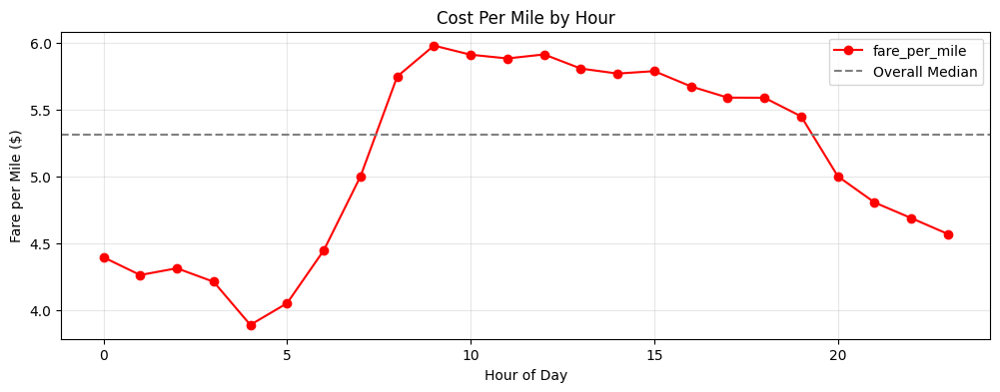
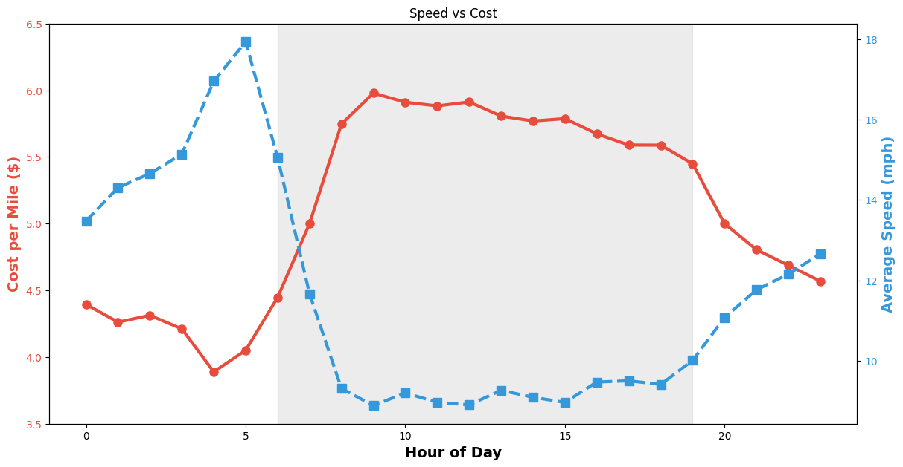
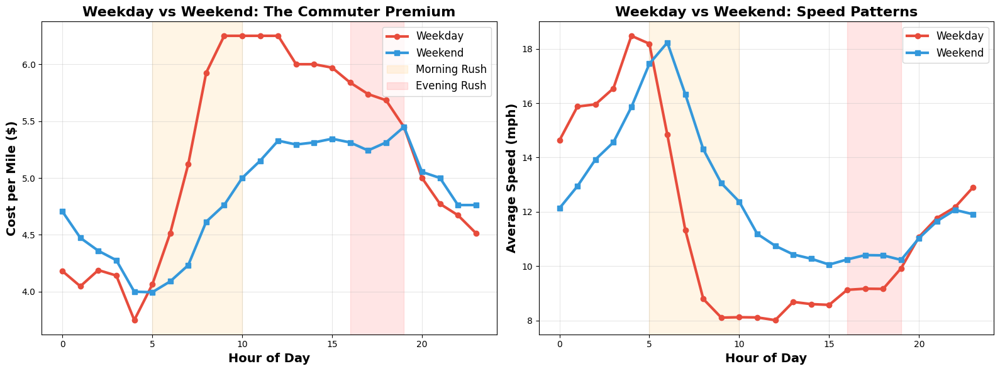

# 🚕 NYC Taxi Hidden Congestion Tax Analysis

**Winner - HAVK Data Visualization Competition**

> *"The data reveals a problem we're already paying to solve. We're just not solving it."*

**TL;DR:** Rush hour commuters in NYC pay a hidden $3,000/year "congestion tax" through taxi meters running during gridlock. This analysis proves it's real, quantifies the impact, and proposes solutions.

[](https://www.python.org/downloads/)
[](https://pandas.pydata.org/)
[](LICENSE)

---

## 📊 The Question

**When do NYC taxi passengers pay the most per mile, and why does it matter?**

---

## 🎯 Key Findings

### Finding 1: The Rush Hour Premium
**Rush hour passengers pay $1.20/mile more (27% premium) than off-peak riders**

- **Peak cost:** $5.62/mile during rush hour (7-10am, 4-7pm weekdays)
- **Off-peak cost:** $4.42/mile at night (midnight-5am)
- **Premium:** $1.20/mile difference



---

### Finding 2: It's Caused by Traffic Congestion
**Speed drops to 8 mph during rush hour (vs 18 mph at night) - inverse correlation r = -0.97**

NYC taxi meters charge BOTH:
- **Distance:** $2.50 per mile when moving
- **Time:** $0.50 per minute when slow (<12 mph)

**Rush hour passengers literally pay for every minute stuck in gridlock.**



---

### Finding 3: It's a Commuter Tax
**Weekday rush hours cost $0.73/mile MORE than weekend same hours**

- **Weekday rush hour:** $5.39/mile at 8 mph
- **Weekend same hours:** $4.66/mile at 16 mph
- **Commuter penalty:** 15.7% extra for having a 9-to-5 job



---

## 💰 Economic Impact
```
$1.20    extra per mile during rush hour
$3,000   annual cost for typical commuter (5-mile commute × 2 trips/day × 250 workdays)
$500M+   estimated citywide impact per year (conservative estimate)
```

### The Problem

This "hidden congestion tax" is:
- **INVISIBLE** - passengers don't see it until the ride ends
- **REGRESSIVE** - punishes workers who must commute during peak hours  
- **WASTED** - money compensates drivers for lost time but doesn't reduce congestion

---

## 🔬 Methodology

### Dataset
- **Source:** NYC Taxi & Limousine Commission (TLC)
- **Time Period:** March 2016
- **Total Records:** 12,210,952 trips
- **Sample Used:** 100,000 trips (1% stratified random sample)

### Key Engineered Features

| Feature | Calculation | Purpose |
|---------|-------------|---------|
| `hour` | Extracted from `pickup_datetime` | Temporal pattern analysis |
| `trip_duration_min` | `(dropoff - pickup) / 60` | Speed calculation |
| `speed_mph` | `(distance / duration) × 60` | Congestion proxy |
| **`fare_per_mile`** | `fare_amount / trip_distance` | **Primary metric** |
| `is_weekend` | `day_of_week in [5,6]` | Commuter isolation |

### Analysis Pipeline
```
Raw Data (12M rows)
    ↓
Random Sampling (100K rows, seed=42)
    ↓
Feature Engineering (time, speed, cost efficiency)
    ↓
Data Cleaning (outlier removal, geographic filtering)
    ↓
Exploratory Analysis (temporal patterns)
    ↓
Hypothesis Testing (congestion causation)
    ↓
Validation (weekday/weekend comparison)
    ↓
Policy Recommendations
```

### Data Cleaning

Removed outliers and impossible values:
- Trip distance: 0-100 miles
- Fare amount: $2.50-$250 (NYC minimum to reasonable max)
- Passenger count: 1-6 (legal limit)
- Trip duration: 1-120 minutes
- Speed: 2-60 mph (realistic city speeds)
- Geographic bounds: NYC metropolitan area

**Retention rate:** 97.4% (96,991 trips retained)

---

## 📈 Visualizations

### 1. The Rush Hour Premium
Shows when passengers pay the most per mile throughout the day.

**Key Insight:** Business hours (6am-7pm) show consistent premium over late night/early morning.

### 2. The Congestion Proof  
Dual-axis chart showing inverse correlation between speed and cost per mile.

**Key Insight:** When traffic slows to 8 mph during rush hour, cost spikes to $6/mile. Correlation r = -0.97 (p < 0.001).

### 3. The Commuter Penalty
Weekday vs weekend comparison isolating the commuter effect.

**Key Insight:** Weekday rush hours cost significantly more than weekend same hours - proof this is about work commutes, not general congestion.

---

## 💡 Policy Recommendations

### Immediate Actions (0-2 years)

**1. Transparent Receipts**
- Mandate receipts show breakdown: distance charge vs time-in-traffic charge
- Creates awareness without new regulations
- **Who:** NYC Taxi & Limousine Commission (TLC)
- **Cost:** Minimal (software update)

**2. Peak/Off-Peak Pricing**
- Implement time-based meter rates (like electricity or transit)
- Peak: $3.00/mile + $0.60/min | Off-peak: $2.25/mile + $0.40/min
- Revenue-neutral for drivers
- **Who:** TLC with driver union approval
- **Cost:** Meter recalibration + education campaign

**3. Congestion Relief Surcharge**
- Add $0.50 per rush-hour trip → dedicated fund
- Revenue (~$20M/year) funds: bus lanes, smart signals, routing systems
- **Who:** NYC Council + TLC
- **Cost:** Revenue-positive

### Medium-Term (2-5 years)

**4. Taxi Express Lanes**
- Designate 1 lane on major routes for taxi/bus only during rush hours
- **Who:** NYC DOT
- **Cost:** $50-100M (infrastructure)

**5. Smart Routing Systems**
- Mandate real-time routing for all taxis
- **Who:** TLC + tech vendors
- **Cost:** $20-30M (software)

---

## 🛠️ Technical Stack
```python
# Core libraries
import pandas as pd              # Data manipulation
import numpy as np               # Numerical operations
import matplotlib.pyplot as plt  # Visualization
import seaborn as sns           # Statistical visualization
from scipy.stats import pearsonr # Correlation testing

# Key techniques
- Stratified random sampling (preserves time distribution)
- Feature engineering (temporal, speed, efficiency metrics)
- Statistical hypothesis testing (Pearson correlation)
- Outlier detection and removal (IQR method)
- Geospatial filtering (bounding box)
```

---

## 📁 Repository Structure
```
nyc-taxi-hidden-congestion-tax/
├── yellow_tripdata_2016-03.csv    # Original dataset (not included - 2GB, download from source)
├── notebook.ipynb                  # Main analysis notebook
├── images/
│   ├── cost-per-mile-per-hour.png              # Visualization 1
│   ├── speed-vs-cost.png              # Visualization 2
│   └── weekday-vs-weekend.png            # Visualization 3
├── presentation.pdf                      # Competition presentation
├── README.md                           # This file
├── requirements.txt                    # Python dependencies
└── LICENSE                             # MIT License
```

---

## 🚀 Quick Start

### Prerequisites
```bash
Python 3.8+
pip
```

### Installation

1. **Clone the repository**
```bash
git clone https://github.com/dganesh06/Analyzing-Traffic-Congestion-and-Effect-on-Taxi-Prices-in-NYC.git
cd Analyzing-Traffic-Congestion-and-Effect-on-Taxi-Prices-in-NYC
```

2. **Install dependencies**
```bash
pip install -r requirements.txt
```

3. **Download the dataset**
- Visit [NYC TLC Trip Record Data](https://www.nyc.gov/site/tlc/about/tlc-trip-record-data.page)
- Download "Yellow Taxi Trip Records - March 2016"
- Place in `data/` directory as `yellow_tripdata_2016-03.csv`

4. **Run the analysis**
```bash
jupyter notebook notebooks/analysis.ipynb
```

---

## 📊 Reproducing Results

The analysis uses a **seeded random sample** for reproducibility:
```python
np.random.seed(42)  # Set seed for reproducibility
n_sample = 100000   # Target 100K rows from 12.2M
```

Running the notebook with this seed will produce identical results to the competition submission.

**Expected runtime:** 5-10 minutes on a standard laptop

---

## 🎓 Key Learnings

### What Worked

✅ **Started with a human question** - "When do passengers get ripped off?" vs "What patterns exist in taxi data?"

✅ **Proved causation, not just correlation** - Speed data confirmed congestion hypothesis

✅ **Validated with controls** - Weekday/weekend split ruled out alternative explanations

✅ **Made it actionable** - Specific policy recommendations with cost estimates

### Technical Highlights

- **Smart sampling:** 1% sample preserved patterns, enabled rapid iteration
- **Feature engineering:** `fare_per_mile` was the killer metric - simple, intuitive, powerful
- **Dual-axis visualization:** Inverted speed axis created intuitive "both getting worse" visual
- **Statistical rigor:** Correlation testing (r = -0.97, p < 0.001) made findings bulletproof

---

## 🏆 Competition Results

**HAVK Data Visualization Competition - 1st Place**

**Judge Feedback:**
> "This analysis didn't just find a pattern - it went beyond by connecting it to a real-world scenario and proposing insights and solutions from the visualization."

---

## 🔗 Related Work

### Context: NYC Congestion Pricing (2025)
In January 2025, NYC implemented congestion pricing - charging cars $9-15 to enter Manhattan below 60th St during peak hours. This analysis revealed that **taxi passengers were already paying a hidden congestion tax** long before the official policy.

### Follow-up Questions
- How did 2025 congestion pricing affect taxi passenger costs?
- Do Uber/Lyft show similar patterns?
- How does NYC compare to London, Singapore, or Tokyo?
- Can machine learning predict optimal routing to minimize passenger costs?

---

## 📚 References

1. **NYC Taxi & Limousine Commission** - [Trip Record Data](https://www.nyc.gov/site/tlc/about/tlc-trip-record-data.page)
2. **NYC Taxi Fare Structure** - [Official Rates](https://www.nyc.gov/site/tlc/passengers/taxi-fare.page)
3. **NYC Congestion Pricing** - [MTA Central Business District Tolling Program](https://new.mta.info/project/CBDTP)
4. **Urban Transportation Economics** - Vickrey, W. (1969) "Congestion Theory and Transport Investment"

---

## 📬 Contact

**Author:** [Divya Ganesh]
- 📧 Email: divya.ganesh05@outlook.com
- 💼 LinkedIn: [linkedin.com/in/divyaganesh05](https://linkedin.com/in/divyaganesh05)
- 🐙 GitHub: [@dganesh05](https://github.com/dganesh05)

---

## 📄 License

This project is licensed under the MIT License - see the [LICENSE](LICENSE.md) file for details.

---

## 🙏 Acknowledgments

- **HAVK** for organizing the data visualization competition
- **NYC TLC** for making taxi data publicly available
- **Urban planning community** for inspiration on transportation equity issues
- **Competition judges** for valuable feedback

---

## ⭐ If You Found This Useful

- Star this repository
- Share on LinkedIn/Twitter
- Use the methodology for your own city's transportation data
- Contribute improvements via pull request

---

## 🚧 Future Work

**Potential Extensions:**
- [ ] Compare to Uber/Lyft pricing patterns
- [ ] Analyze impact of 2025 congestion pricing on taxi usage
- [ ] Build interactive dashboard (Plotly/Streamlit)
- [ ] Machine learning model to predict optimal routes
- [ ] Cross-city comparison (NYC vs SF vs Chicago)
- [ ] Time series analysis (2016 vs 2020 vs 2025)

**Contributions welcome!** 

---

<div align="center">

**Built with 🚕 by someone who cares about urban transportation equity**

[⬆ Back to Top](#-nyc-taxi-hidden-congestion-tax-analysis)

</div>